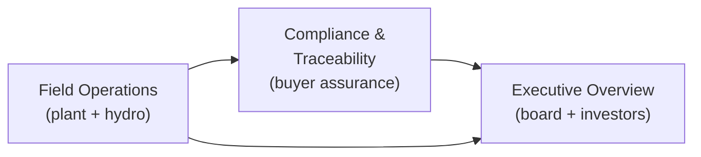

# Aether — pitch deck copy (outline + talk track)

**Purpose:** Slide-ready narrative blocks for investor, buyer, and regulator-facing decks. Iterate here; export to Keynote/PDF separately.

**Last synced from codebase:** 2026-04-08  
**Source:** [`HANDOFF.md`](../../HANDOFF.md), [`README.md`](../../README.md), product positioning in views, governance disclaimers in `mockDataService` / executive tabs, and stakeholder stress-test personas (issuer → capital → buyers → society → ecosystem → media).

---

## Slide 0 — Honesty paragraph (media, retail, any skeptical room)

*Place early in appendix or verbally after title. Journalists and equity researchers reward this; competitor intel cannot use ambiguity against you.*

**Suggested copy**  
This demo mixes three kinds of information: **(1)** public-reference geometry and citations where noted, **(2)** illustrative scenarios and dashboards aligned to disclosed materials where labeled, and **(3)** **simulated** plant and environmental time series for UX rehearsal — **not** a substitute for IMS, permit registers, competent-person sign-off, or filed instruments. Nothing on screen is an attestation unless your counsel and IR attach a **versioned, board-approved facts** layer to a production build.

---

## Slide 1 — Title

**Aether OS**  
Critical Mineral OS — the trust layer for REE supply chains

**Subtitle**  
Telemetry · compliance · traceability · capital — one stack

---

## Slide 2 — The problem

- Critical minerals are **national security and industrial policy** (FEOC, IRA, EU battery passport).  
- Operators face **permitting and water** as the real bottleneck — not only grade and tonnes.  
- Buyers need **defensible provenance**; boards need **one coherent story** across technical, ESG, and financial workstreams.  
- Spreadsheets and slide decks **don't survive diligence** when geometry, citations, and telemetry don't line up.  
- **US DoD faces 18–24 month procurement delays** when FEOC documentation is incomplete; **EU Battery Passport enforcement begins Feb 2027** with no industry-standard tooling.

---

## Slide 3 — What Aether is

**Aether** is a B2B **"Trust Bridge"** and compliance clearinghouse for the rare earth supply chain:

- **Field narrative** — operations and hydrology on a map with **explicit provenance** (public geometry vs modeled vs simulated telemetry).  
- **Trade narrative** — FEOC / IRA / passport-style **evidence metaphors** and batch ledger — scoped as **repository design**, not certification, until attestation chains and document types are wired.  
- **Board narrative** — scenarios, risk, capital, DFS rhythm, agency matrix, audit trail, ESG coverage — **aligned to steerco and disclosure rhythm**, not a replacement for formal reporting.

**Single source of narrative (internal alignment)**  
One canvas helps **synchronize** DFS, regulatory log, and field story — so engineering, permitting, IR, and community don't each tell a **slightly different** tale in the same week.

**Non–system-of-record boundary (say this out loud)**  
Aether is **not** IMS, not the permit-conditions register, and not agency submission software. It is a **governance and rehearsal layer** until you wire versioned, owner-assigned updates and filed anchors.

**Geology / hydro firewall**  
**Resource, reserve, and exploration** live in **Executive → Assets** (classification, disclosure discipline). **Hydro Twin** is **monitoring + scenario communication** — not ore proof. Never imply the digital twin **proves** the deposit.

**Flagship showcase:** **Meteoric Resources — Caldeira Project** (Poços de Caldas, MG, Brazil · ASX: MEI).

---

## Slide 4 — Who we built the prototype to convince

| Audience | What they need |
|----------|----------------|
| **Buyers** (DoD, OEMs, magnet makers) | Defensible chain-of-custody **design**, security and integration path — not "dashboard as authority" |
| **Regulators / agencies (narrative)** | Cumulative impact and monitoring **story** with honest limits on what is modeled |
| **Operators** (Meteoric, partners) | Plant + hydro visibility; **who updates what** when schedules slip |
| **Executives / board** | Financial + ESG + risk in one rhythm; **disclosure-aligned** figures for market-facing sessions |
| **Project sponsor / VP Projects** | One narrative canvas for silos; explicit **SOR boundary** |
| **IR / listed issuer** | **Disclosure mode** concept — versioned, dated, board-approved facts feeding market demos |
| **Permitting & env consultants** | Transparency layer **or** opponent dissect layer — label **modeled** vs **instrument**; path to method-statement exports |
| **Community / social performance** | Listening + monitoring plan + response — not prediction-as-promise; avoid spring colors as **verdict** on livelihoods |
| **PF / ECAs / insurers** | Capital · risk · regulatory log thread; path to **audit → IE** — not "AI replaces legal opinion" |
| **Integrators (SCADA / PI)** | Clean **data-service seam**; read-only historians, OT boundaries — we don't replace control-room HMI |
| **Media / researchers** | Clear **fake vs public vs modeled** paragraph; primary docs still win headlines |

---

## Slide 5 — Product: three experiences (demo)

**1. Field Operations**  
- **Operations** map: terrain-aligned licences, pilot and commercial plant sites, PFS pit and spent clay, named drill collars, optional logistics rehearsal layers (off by default).  
- **Hydro Twin:** springs, nodes, APA/buffer context, cumulative aquifer narrative — **LI defense** positioning.

**Strapline (Ops):** Pilot telemetry → board-grade trust layer  
**Strapline (Hydro):** Hydro Digital Twin → cumulative aquifer + spring model → LI defense

**2. Compliance & Traceability**  
- Map: **Caldeira → export corridor** narrative.  
- **FEOC / IRA / passport** at **headline** level — pair with **attestation and mass-balance** roadmap for OEM rooms; avoid "0.00% reads like certification" without **who audits** and **which documents** back the claim.  
- **OECD DD / Annex II** framing option: speak in **risk and evidence types** (human rights, environment), not only hashes.  
- **EU enforcement mindset:** roadmap = fields that map to **declaration / passport schemas** (stub acceptable if labeled).  
- **DoD-adjacent rooms:** hero = **tenancy, logging, classification, integration** — not the basemap. Blockchain = precise scope (no non-repudiation fairy tale without **key custody / HSM** story).  
- **Molecular-to-magnet** ledger *(demo hashes; production = ERP/CBP + lab + customs doc types post-pilot).*

**3. Executive Overview**  
Tabs: **Assets · Financials · Risk · Pipeline · Capital · DFS · Agencies · Audit · ESG**  
- Financials: **PFS-aligned scenarios** — not a live market feed; **As of** issuer snapshot with ASX citation path; **IR disclosure mode** = only public-filed figures for external sessions.  
- Agencies: **administrative record (rehearsal)** — verify against filed instruments; **export bundle** as rehearsal for annex / method-statement workflows — not a filed EIA by itself.  
- ESG: dashboard narrative — **not** JORC assurance or statutory reporting.  
- **Capital / insurance angle:** risk register + audit trail as **covenant / control narrative** — pair with roadmap for **alarm acknowledgement, maintenance logs, sensor redundancy** (MRV for credit, not gamified green).

**Data flow (three experiences)**

---

## Slide 6 — Why Caldeira

- **Ionic clay REE** in a well-known Brazilian alkaline complex — resource scale and metallurgy story legible to global investors.  
- **Permitting and stakeholder** context (LP/LI, APA, MPF narrative) maps cleanly to **hydro + agencies** tabs — shows we understand **water and governance**, not only NPV.  
- **Geometry and collars** in-app are **versioned and cited** (`DATA_SOURCES.md`, `issuerSnapshot`) — practice for how we'd run **any** project.

---

## Slide 7 — Technical credibility (without overclaiming)

- **MapLibre** stack with **GeoJSON** layers, click inspectors, and **provenance badges** (simulated vs public record vs illustrative).  
- **Service boundary:** `AetherDataService` — swap mock for live ingestion without rewriting views; **CTO evaluators** care about **DTOs, env flags, CI** as much as gradients.  
- **Data honesty banner:** demo / presentation / live-stub modes with **explicit** copy about what is still simulated.

**Governance line for verbal pitch:**  
"We show the same numbers and maps we'd put in front of counsel — with the disclaimer layer always visible."

**Killer questions to own (speaker notes)**  
- *When DFS slips, does the UI lie until someone edits JSON?* → **Owner matrix + versioned facts layer + stale-date surfacing** (roadmap).  
- *What QP signs off on a screenshot?* → **Nothing** until counsel/IR defines disclosure mode; default demo is **non-reliance**.  
- *Can opponents FOIA spring layers?* → Public geometry labeled; **status colors = modeled UX**, not agency findings.  
- *Community "red phone"?* → **Response protocol** and **co-designed** monitoring narrative — product does not replace grievance mechanics.

---

## Slide 8 — Traction / engineering signals

- **19 GeoJSON datasets** integrated (deposits, licences, drill collars, springs, infrastructure, environmental zones).  
- **131 automated tests** across data service, generators, UI components, and GeoJSON schema validation.  
- **3 audience-specific views** with **14 interactive map overlay layers**.  
- **2-second simulated telemetry pulse** across **10+ sensor channels**.
- **85 TypeScript source modules**, design-token consolidated, accessibility hardened, lazy-loaded views.

**Roadmap (verbal / appendix)**  
Wire **historian / SCADA** (read-only / unidirectional gateway) or lab LIMS for verified channels — **OPC-UA / MQTT** and latency SLOs; **ANM / IEF** vector imports; **ERP + CBP** hooks for ledger and passport export; **IR disclosure mode**, **alarm ack + maintenance**, **multi-tenant + audit logging**. **Society / local (Brazil):** plain-language **jobs, fiscal, monitoring independence**; **PT** collateral for Poços stakeholders.

---

## Slide 8.5 — Market opportunity

- **TAM:** Critical minerals compliance and traceability SaaS — estimated **$2.4B by 2030** (aligned to rare earth supply chain digitization).  
- **SAM:** REE project operators, off-takers, and defense procurement requiring FEOC / IRA / EU DBP tooling — **~$400M**.  
- **SOM:** First **5 operators** with active REE projects in allied jurisdictions (Brazil, Australia, USA, Canada) — **$15–25M ARR** at scale.

*Note: Market sizing is directional. Methodology: top-down from critical minerals supply chain digitization estimates (Allied Market Research, Grand View Research); bottom-up from identified REE projects with active permitting/DFS in allied jurisdictions. Refine with sector-specific analyst reports before investor-grade decks.*

---

## Slide 8.75 — Team

**Carlos Toledo** — Founder, Product & Technical Lead
- **Born and raised in Pocos de Caldas** — inside the Caldeira. 40 years of local context no outside team can replicate.
- **Brazilian Air Force Academy** (pilot) — systems discipline, operational rigor.
- **Full-stack developer + Product Design degree** — built the entire prototype solo (131 tests, 19 GeoJSON datasets, 14 overlay layers, accessibility-hardened).

**Dr. Heber Caponi** — Chief Scientific Advisor (LAPOC)
- **Decades of active field research** on the Caldeira alkaline complex. Still conducting fieldwork today.
- The scientific authority who converts Aether's "simulated" labels into **"field-verified"** labels.
- LAPOC instrument data is the **first live data channel** — the bridge from demo to product.

**Thiago A.** — CEO (designated)
- Deep experience in **Brazilian and international law**, enterprise operations, and development team management.
- Owns corporate structure, legal architecture, and commercial execution at pilot activation.

**Full-Stack Developer** — Engineering (designated)
- Ready to ship at pilot approval. Codebase is architected for immediate second-developer productivity.

**Why this team wins:**  
Aether is not built by consultants studying Caldeira from Perth or New York. It is built **inside the Caldeira** — by a founder who grew up on the geology, validated by a scientist who has studied it for decades, with a CEO who knows Brazilian law, and an engineer ready to scale. No competitor can assemble this combination.

---

## Slide 9 — Ask

**For investors:** Capital to harden ingestion, security, and first production integration (one operator + one off-taker).  
**For buyers:** Design partnership on **passport schema** and **batch attestation** API.  
**For Meteoric / operators:** Pilot deployment on **hydro + discharge** KPIs tied to LI conditions.

---

## Appendix A — One-liners (speaker notes)

- "We're not selling magic AI — we're selling **aligned truth** across the plant, the map, and the filing."  
- "The Hydro Twin tab exists because **water is the permit**, not the pit shell."  
- "Everything flashy is labeled **demo**; everything cited links to **your** disclosure rule."

---

## Appendix B — Words to avoid in regulated rooms

Avoid implying: cadastral survey accuracy, final permit outcomes, or live exchange prices unless sourced and labeled. Prefer: **illustrative**, **rehearsal**, **verify against ASX**, **non-survey geometry**.

Avoid implying: **compliance green** without permit condition IDs and sampling methodology; **FEOC / IRA / passport** as **certification** without attestation chain; **digital twin proves resource**; **AI compliance** replacing legal opinions or IE reports; **blockchain = non-repudiation** without key custody; replacing **SCADA / IMS**.

---

## Appendix C — Stakeholder coverage map (stress-test grid)

Use internally to ensure a deck rehearsal hits every bucket at least once.

| Bucket | Personas (abbrev.) |
|--------|---------------------|
| Issuer technical | Chief geologist / QP mindset; permitting consultant |
| Issuer commercial / governance | VP Projects; IR; community liaison |
| Capital / risk | Project finance / ECA; insurer; retail / family office |
| Buyers / compliance | OEM responsible sourcing; DoD program; EU enforcement mindset |
| Society / politics | NGO / water justice; local political (jobs, water, PT) |
| Ecosystem | SCADA integrator |
| Adversarial | Competitor intel; journalist / researcher |
| Platform truth | Product / engineering evaluator |

---

## Appendix D — Competitor intel calibration (rhetorical)

They will cross-check: **green premium**, recovery vs nameplate, ESG coverage %, FEOC language, basket consistency. **Response:** tie numbers to **one issuer snapshot + citations**; label simulation; never outrun **filed** disclosure.

---

## Appendix E — Persona-scored feedback (current release)

**Evaluation date:** 2026-04-08 (post CTO code review — 131 tests, design tokens, a11y, CSS modules, lazy loading)

| Persona | Score | Top strength | Top gap |
|---------|-------|-------------|---------|
| Executive Chairman | 7.5/10 | Governance posture + data honesty | Disclosure mode not implemented |
| CEO & MD | 7.0/10 | Financial scenario + capital alignment | Production roadmap with milestones |
| Chief Geologist | 7.5/10 | Geology/hydro firewall + data pedigree | Drill trace viz + JORC badges |
| DoD Buyer | 6.5/10 | Scope 3 + cyber awareness | FedRAMP + deployment architecture |
| EU Regulator | 6.0/10 | Schema-aligned concept | DPP field mapping export |
| Project Finance | 7.0/10 | Risk + capital + ESG frameworks | DSCR + alarm acknowledgement |
| Water Justice NGO | 5.5/10 | Monitoring plan + APA buffer | Spring disclaimer visibility |
| SCADA Integrator | 7.5/10 | Data service architecture + CI | OPC-UA spec + OpenAPI |
| Journalist | 6.5/10 | Intellectual honesty + citations | Sourced TAM + customer LOIs |

**Weighted average: 6.8/10** — see [`docs/Personas.md`](../Personas.md) for full evaluations, persona voices, and priority action list.

---

## Iteration checklist

1. Update deck copy here after each narrative change.
2. Reconcile with [`WEBSITE_COPY.md`](./WEBSITE_COPY.md).
3. Update [`HANDOFF.md`](../../HANDOFF.md) "pitch to" table if audiences shift.
4. Keep financial and resource numbers chained to [`issuerSnapshot.ts`](../../src/data/caldeira/issuerSnapshot.ts) + latest ASX rule.
5. After each release, update persona scores in Appendix E and [`docs/Personas.md`](../Personas.md).
