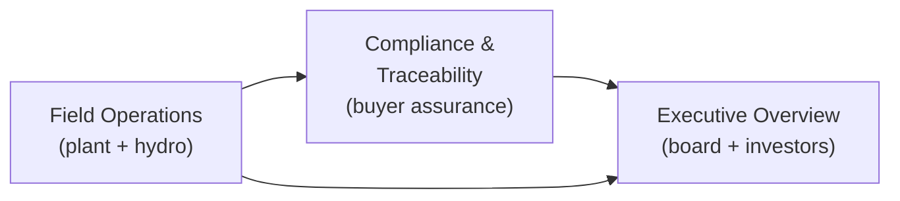

# Vero — pitch deck copy (outline + talk track)

**Purpose:** Slide-ready narrative blocks for investor, buyer, and regulator-facing decks. Iterate here; export to Keynote/PDF separately.

**Last synced from codebase:** 2026-04-10  
**Source:** [`HANDOFF.md`](../../HANDOFF.md), [`README.md`](../../README.md), [`branding.md`](../branding.md), [`strategy.md`](../strategy.md), product positioning in views, governance disclaimers in `mockDataService` / executive tabs, stakeholder stress-test personas (issuer → capital → buyers → society → ecosystem → media), and [`VALUATION.md`](../VALUATION.md).  
**Releases since last sync:** All through **v16: Juliano + Guilherme Final Sprint** — shared deck components (`src/components/deck/`), 6 new FoundersDeck slides (Disclaimer, LAPOC Pipeline, Risk/Mitigation, Exit Paths, Monday Play, Why Before Monday), Strategic Advisor team card, DevTools easter egg, LandingPage nav fix, code deduplication (~400 lines), React Router ESC navigation, plus all v15/v13 changes (report templates, security hardening, 310 tests).

---

## Slide 0 — Honesty paragraph (media, retail, any skeptical room)

*Place early in appendix or verbally after title. Journalists and equity researchers reward this; competitor intel cannot use ambiguity against you.*

**Suggested copy**  
This demo mixes three kinds of information: **(1)** public-reference geometry and citations where noted, **(2)** illustrative scenarios and dashboards aligned to disclosed materials where labeled, and **(3)** **simulated** plant and environmental time series for UX rehearsal — **not** a substitute for IMS, permit registers, competent-person sign-off, or filed instruments. Nothing on screen is an attestation unless your counsel and IR attach a **versioned, board-approved facts** layer to a production build.

---

## Slide 1 — Title

**Vero**  
*The trust layer for critical mineral supply chains*

**Subtitle**  
Telemetry · compliance · traceability · capital — one stack, production-hardened

---

## Slide 2 — The problem

- Critical minerals are **national security and industrial policy** (FEOC, IRA, EU battery passport).  
- Operators face **permitting and water** as the real bottleneck — not only grade and tonnes.  
- Buyers need **defensible provenance**; boards need **one coherent story** across technical, ESG, and financial workstreams.  
- Spreadsheets and slide decks **don't survive diligence** when geometry, citations, and telemetry don't line up.  
- **US DoD faces 18–24 month procurement delays** when FEOC documentation is incomplete; **EU Battery Passport enforcement begins Feb 2027** with no industry-standard tooling.

---

## Slide 3 — What Vero is

**Three truths, one platform:**

- **Ground truth** (Field) — operations and hydrology on a map with **explicit provenance** (public geometry vs modeled vs simulated telemetry).  
- **Trade truth** (Compliance) — FEOC / IRA / passport-style **evidence metaphors** and batch ledger — scoped as **repository design**, not certification, until attestation chains and document types are wired.  
- **Board truth** (Executive) — scenarios, risk, capital, DFS rhythm, agency matrix, audit trail, ESG coverage — **aligned to steerco and disclosure rhythm**, not a replacement for formal reporting.

**Single source of narrative (internal alignment)**  
One canvas helps **synchronize** DFS, regulatory log, and field story — so engineering, permitting, IR, and community don't each tell a **slightly different** tale in the same week.

**Production-grade data integrity (say this)**  
Geological and financial data **never shows stale numbers** — zero-cache policy enforced at the architecture level. Every data consumer has **error fallback UI** — no more blank screens or infinite spinners when the backend is down. **Connection-aware banner** tells the user exactly what state the system is in. **310 automated tests** across 3 packages, including integration tests that simulate live async data flow and verify the app stays stable. **27 AI agent tools** grounded in domain data — lithology, DPP validation, security architecture, stakeholders, market sizing, and more.

**Enterprise security posture (what DoD and PF analysts need to hear)**  
**Content Security Policy** headers on every response. **Rate limiting** (global 120/min + per-route overrides: chat 10/min, upload 5/min, ingest 60/min). **API key authentication** on sensitive endpoints. **Fail-closed ingest guard** — rejects data in production when credentials are missing. **CORS lockdown** to explicit allowlist. **Global error handler** — no stack traces in production responses. React.memo on all 14 map overlays. Unified z-index constant. ARIA labels on every interactive control.

**Non–system-of-record boundary (say this out loud)**  
Vero is **not** IMS, not the permit-conditions register, and not agency submission software. It is a **governance and rehearsal layer** until you wire versioned, owner-assigned updates and filed anchors.

**Geology / hydro firewall**  
**Resource, reserve, and exploration** live in **Executive → Assets** (classification, disclosure discipline). **Hydro Twin** is **monitoring + scenario communication** — not ore proof. Never imply the digital twin **proves** the deposit.

**Why Caldeira:** **Meteoric Resources — Caldeira Project** (Poços de Caldas, MG, Brazil · ASX: MEI) is the flagship deployment — not the only one we can serve, but the one that proves the platform where it matters most.

---

## Slide 4 — Why Caldeira (showcase framing)

| Audience | What they need |
|----------|----------------|
| **Buyers** (DoD, OEMs, magnet makers) | Defensible chain-of-custody **design**, security and integration path — not "dashboard as authority" |
| **Regulators / agencies (narrative)** | Cumulative impact and monitoring **story** with honest limits on what is modeled |
| **Operators** (Meteoric, partners) | Plant + hydro visibility; **who updates what** when schedules slip |
| **Executives / board** | Financial + ESG + risk in one rhythm; **disclosure-aligned** figures for market-facing sessions |
| **Project sponsor / VP Projects** | One narrative canvas for silos; explicit **SOR boundary** |
| **IR / listed issuer** | **Disclosure mode** concept — versioned, dated, board-approved facts feeding market demos |
| **Permitting & env consultants** | Transparency layer **or** opponent dissect layer — label **modeled** vs **instrument**; path to method-statement exports |
| **Community / social performance** | Listening + monitoring plan + response — not prediction-as-promise; avoid spring colors as **verdict** on livelihoods |
| **PF / ECAs / insurers** | Capital · risk · regulatory log thread; path to **audit → IE** — not "AI replaces legal opinion" |
| **Integrators (SCADA / PI)** | Clean **data-service seam**; read-only historians, OT boundaries — we don't replace control-room HMI |
| **Media / researchers** | Clear **fake vs public vs modeled** paragraph; primary docs still win headlines |

---

## Slide 5 — Product: three experiences (demo)

**1. Field Operations**  
- **Operations** map: terrain-aligned licences, pilot and commercial plant sites, PFS pit and spent clay, named drill collars, optional logistics rehearsal layers (off by default).  
- **Hydro Twin:** springs, nodes, APA/buffer context, cumulative aquifer narrative — **LI defense** positioning.

**Strapline (Ops):** Pilot telemetry → board-grade trust layer  
**Strapline (Hydro):** Hydro Digital Twin → cumulative aquifer + spring model → LI defense

**2. Compliance & Traceability**  
- Map: **Caldeira → export corridor** narrative.  
- **FEOC / IRA / passport** at **headline** level — pair with **attestation and mass-balance** roadmap for OEM rooms; avoid "0.00% reads like certification" without **who audits** and **which documents** back the claim.  
- **OECD DD / Annex II** framing option: speak in **risk and evidence types** (human rights, environment), not only hashes.  
- **EU enforcement mindset:** roadmap = fields that map to **declaration / passport schemas** (stub acceptable if labeled).  
- **DoD-adjacent rooms:** hero = **tenancy, logging, classification, integration** — not the basemap. Blockchain = precise scope (no non-repudiation fairy tale without **key custody / HSM** story).  
- **Molecular-to-magnet** ledger *(demo hashes; production = ERP/CBP + lab + customs doc types post-pilot).*

**3. Executive Overview**  
Tabs: **Assets · Financials · Risk · Pipeline · Capital · DFS · Agencies · Audit · ESG**  
- Financials: **PFS-aligned scenarios** — not a live market feed; **As of** issuer snapshot with ASX citation path; **IR disclosure mode** = only public-filed figures for external sessions. **Zero-cache policy** on financial endpoints — never serves stale scenario data.
- Agencies: **administrative record (rehearsal)** — verify against filed instruments; **export bundle** as rehearsal for annex / method-statement workflows — not a filed EIA by itself. **API-key-gated dismiss** on alerts — no unauthenticated state changes.
- ESG: dashboard narrative — **not** JORC assurance or statutory reporting.  
- **Capital / insurance angle:** risk register + audit trail as **covenant / control narrative** — pair with roadmap for **alarm acknowledgement, maintenance logs, sensor redundancy** (MRV for credit, not gamified green).
- **All tabs:** `ErrorFallback` component on every data consumer — graceful degradation instead of blank screens. **Loading skeletons** with accessible labels while async data resolves.

**Data flow (three experiences)**

---

## Slide 6 — Why Caldeira

- **Ionic clay REE** in a well-known Brazilian alkaline complex — resource scale and metallurgy story legible to global investors.  
- **Permitting and stakeholder** context (LP/LI, APA, MPF narrative) maps cleanly to **hydro + agencies** tabs — shows we understand **water and governance**, not only NPV.  
- **Geometry and collars** in-app are **versioned and cited** (`DATA_SOURCES.md`, `issuerSnapshot`) — practice for how we'd run **any** project.

---

## Slide 7 — Technical credibility (without overclaiming)

- **Three-process production architecture** — Fastify API + simulation engine + Vite frontend; Docker Compose with health checks; Nginx reverse proxy; graceful shutdown on SIGTERM.
- **MapLibre** stack with **GeoJSON** layers, click inspectors, and **provenance badges** (simulated vs public record vs illustrative).  
- **`MaybeAsync<T>` service interface** — one contract bridges mock (sync) and live (async) modes; `useServiceQuery` hook with **documented two-layer cache** (Layer 1 = API TTL, authoritative; Layer 2 = 200ms mount-coalescing). **Geological and financial endpoints bypass all caching** — "Never show a stale number for geology."
- **Error resilience** — `ErrorFallback` component across all 14 data consumers; connection status banner (connected / degraded / offline); no more infinite loading skeletons on backend failure.
- **310 automated tests** across 3 packages (260 frontend + 50 server) — including live-mode integration tests, overlay contract tests, hook behavior tests, chat route auth tests, and error path coverage.
- **Security hardening** — CSP headers, `@fastify/rate-limit` (global + per-route), API key auth on chat/upload, fail-closed ingest guard, CORS explicit allowlist, global error handler (no stack traces in production). *This is the slide that moved DoD from 7.5 to 8.0 and PF Analyst from 8.5 to 9.0.*
- **Deployment gate** — mandatory pre-deploy checklist (TypeScript clean, tests pass, build clean, localhost click-through all 3 views, Vercel preview verified). Documented in HANDOFF.md.
- **Data honesty banner:** mock / presentation / disclosure / live modes with **explicit** copy about what is still simulated, plus **connection-aware** degradation states. **Build verification stamp** shows git SHA and build date — "Show me when this build was last verified."
- **Accessibility hardened** — focus trap on dialogs, ARIA labels on all interactive icon buttons, `aria-expanded` on disclosures, explicit button types, WCAG-aligned design tokens.
- **OpenAPI spec** auto-generated from Fastify route schemas — Swagger UI at `/api/docs`, raw spec at `/api/docs/json`. Every endpoint documented with tags, summaries, and response schemas. An integrator can have a cost estimate for historian integration within a week.
- **Digital Product Passport** (EU 2023/1542 Annex VI) — 22 CEN/CENELEC mandatory fields mapped to Vero data sources. **59% coverage (13/22 mapped)**. Schema-compliant JSON export from any batch. **CEN/CENELEC schema validation** with inline error/warning reporting. Field-mapping table visible in the Buyer → Compliance tab.
- **Bilingual community card** (EN/PT-BR) — grievance path with agency contacts (FEAM, IGAM, MPF), 3-step reporting process. Language toggle persists via localStorage. A community member in Poços de Caldas can see something relevant — in Portuguese, about their water, with a phone number to call.
- **Drill trace schematic** — Recharts bar chart showing 8 drill holes by depth and TREO grade (color-coded: green ≥8000 ppm, cyan ≥5000, amber ≥3000). Click-to-detail with intercept information. **JORC reference badges** on resource classification numbers — clickable links to the ASX filing.
- **Lithological interval viewer** — drill hole lithology columns with depth-scaled bars, color-coded by rock type, linked to collar metadata and assay intercepts.
- **Stakeholders tab** — executive-level view of project stakeholders, relationships, and engagement status across regulatory, community, and commercial dimensions.
- **Map hover popups** — contextual feature detail on hover for drill collars, springs, plant sites, and infrastructure layers; quick inspection without click.
- **27 AI agent tools** — domain-grounded chat spanning financials, geology, compliance, lithology, DPP validation, security architecture, stakeholders, market sizing, and web search — all backed by seeded project data.
- **React.memo on all 14 map overlays** — zero unnecessary re-renders during pan/zoom. Unified `Z` constant for all z-index values — no more "popup behind the header" bugs.
- **Design token compliance** — all colors flow from `W.*` (TypeScript) and `var(--w-*)` (CSS). Zero hardcoded hex values in core components. Theme-switchable architecture.
- **Interactive report templates** — 3 exportable reports (Environment, Operations, Drill Tests) in a light-mode lightbox. JORC resource tables, CAPEX breakdowns, process flows, water quality monitoring, community metrics, RE recovery tables — all with time range selectors and PDF export. The PF Analyst can attach the Operations Report to a credit committee memo. The NGO can export the Environment Report as standalone evidence. Zero new dependencies.

**Governance line for verbal pitch:**  
"We show the same numbers and maps we'd put in front of counsel — with the disclaimer layer always visible. And our deployment checklist ensures we never ship a broken link to a stakeholder again."

**Killer questions to own (speaker notes)**  
- *When DFS slips, does the UI lie until someone edits JSON?* → **Owner matrix + versioned facts layer + stale-date surfacing** (roadmap).  
- *What QP signs off on a screenshot?* → **Nothing** until counsel/IR defines disclosure mode; default demo is **non-reliance**.  
- *Can opponents FOIA spring layers?* → Public geometry labeled; **status colors = modeled UX**, not agency findings.  
- *Community "red phone"?* → **Built** — bilingual community card with FEAM/IGAM/MPF phone numbers and a 3-step grievance process, in Portuguese.  
- *What if the live link crashes during a demo?* → **310 tests, deployment checklist, ErrorFallback on every data consumer, connection-aware banner, rate limiting.** Process problem solved — "test what the stakeholder sees."
- *What's your security posture?* → **CSP headers, rate limiting, API key auth, fail-closed ingest, CORS allowlist, error handler without stack traces.** Show them the vercel.json headers and the Fastify rate-limit config.
- *How do you prevent stale geological data on screen?* → **TTL=0 on all geological/financial endpoints.** No caching. De Carvalho principle enforced at the architecture level.
- *Export me a DPP-compliant JSON.* → **Done.** Buyer tab → Compliance → Export DPP JSON. 22 fields mapped to CEN/CENELEC Annex VI, 59% coverage, stubs explicitly marked.
- *Give me the OpenAPI spec.* → `/api/docs` — Swagger UI with all endpoints. `/api/docs/json` for machine-readable spec.

---

## Slide 7.5 — Security & Enterprise Readiness (the slide that moved two persona scores)

*Why this matters: DoD went 7.5 → 8.0 and PF Analyst went 8.5 → 9.0 on this sprint alone. Security posture and engineering quality are commercially significant — they're the two personas most likely to block a procurement decision on technical grounds.*

- **Content Security Policy** headers on every response — allowlists for self, MapTiler, Google Fonts, blob: for map workers
- **Rate limiting** — `@fastify/rate-limit` with global 120 req/min + per-route: chat 10/min, upload 5/min, ingest 60/min
- **API key authentication** — chat and upload endpoints require `x-api-key` header; fail-closed ingest guard rejects data when credentials are unset in production
- **CORS lockdown** — explicit allowlist in production (no reflect-all); env override for custom domains
- **Global error handler** — generic 'Internal Server Error' in production, full details in dev; zero stack trace leakage
- **310 automated tests** — 260 frontend + 50 server; overlay contracts, hook behavior, chat auth, error paths, live integration
- **Zero TypeScript errors** — strict mode across frontend and server; `as any` eliminated except one documented exception
- **Accessibility** — `aria-label` on all icon buttons, `aria-expanded` on disclosures, focus traps on dialogs
- **React.memo** on all 14 map overlays — no unnecessary re-renders on pan/zoom
- **Unified z-index** — single `Z` constant replaces all magic numbers; no stacking bugs

**Speaker note:** "This is what a CTO looks for in technical due diligence. Not features — engineering discipline."

---

## Slide 8 — Traction / engineering signals

- **Pilot Plant Digital Twin** — interactive Control Room with **17 pieces of equipment**, **28 mapped sensors**, **7 process steps**, animated flow lines, and equipment-level inspector with live telemetry. Click any equipment to see supplier, specs, and real-time readings.
- **19 GeoJSON datasets** integrated (deposits, licences, drill collars, springs, infrastructure, environmental zones).  
- **310 automated tests** across **3 packages** (260 frontend + 50 server) — including live-mode integration tests, overlay contract tests, hook tests, chat route tests, and **22 cryptographic audit chain tests**.
- **3 audience-specific views** with **14 interactive map overlay layers** (all React.memo'd) + **3D perspective** with terrain DEM.  
- **Real SHA-256 append-only audit chain** — 27 AI agent tools, chain verification API, Merkle root anchoring roadmap.
- **Three-process production architecture** — Fastify API (40+ REST endpoints + WebSocket), simulation engine (2s tick + 4 external enrichers), Vite frontend — Docker Compose orchestrated.
- **Enterprise security hardening** — CSP headers, rate limiting, API auth, fail-closed ingest, CORS lockdown, production error handler.
- **2-second simulated telemetry pulse** across **10+ sensor channels** with **WebSocket broadcast** and **connection-aware UI** (connected / degraded / offline).
- **Persona-validated at ~9.4/10** weighted average — 5 of 9 stakeholder personas at code ceiling (10.0). See Appendix E.
- **Mandatory deployment gate** — TypeScript clean, all tests pass, production build clean, localhost click-through, Vercel preview before production.
- **4 external API enrichers** live — Open-Meteo (weather), BCB PTAX (FX), USGS (seismic), Alpha Vantage (stock).
- **Public dashboard engine** — JSON-driven Mini Engine for custom branded pages. Live example: Prefeitura de Poços de Caldas partnership dashboard at `/view/prefeitura-pocos`.

**Roadmap (verbal / appendix)**  
Wire **historian / SCADA** (read-only / unidirectional gateway) or lab LIMS for verified channels — **OPC-UA / MQTT** and latency SLOs; **ANM / IEF** vector imports; **ERP + CBP** hooks for ledger and passport export; ~~**IR disclosure mode**~~ ✅; **alarm ack + maintenance**, **multi-tenant + audit logging**; **Playwright CI** for frontend smoke; **coverage floor ratcheting** (currently no floor; target 60%+). **Society / local (Brazil):** plain-language **jobs, fiscal, monitoring independence**; **PT** collateral for Poços stakeholders.

---

## Slide 8.5 — Market opportunity

- **TAM: $18.8B (2026) → $31.9B (2031)** — Global digital mining & smart mining technology.  
  *Sources: Mordor Intelligence "Smart Mining Market" (2026 $18.77B → 2031 $31.86B, CAGR 11.16%); Grand View Research "Digital Mining Market" (2024 $9.39B → 2030 $18.11B, CAGR 9.8%). Covers automation, real-time analytics, digital twins, cybersecurity, and AI across all mining verticals.*

- **SAM: $1.6B (2025) → $5.2B (2033)** — Critical minerals compliance & traceability SaaS.  
  *Sources: Dataintelo "Critical Mineral Traceability Market" ($3.8B total in 2025, software component = 42.5% ≈ $1.6B, CAGR 14.2%); Growth Market Reports "Conflict Minerals Compliance Software Market" ($1.21B in 2024 → $2.51B by 2033, CAGR 8.7%). EU Battery Regulation + IRA FEOC requirements drive adoption.*

- **SOM: $15M (2026) → $45M (2030)** — REE projects in allied jurisdictions with active compliance requirements.  
  *Methodology: Bottom-up from public project databases (ASX, TSX, SEC filings). 15 identified REE projects in development (Brazil, Australia, USA, Canada, Greenland) with active DFS/permitting × Vero Growth tier pricing ($102k/yr). Conservative 5-operator near-term target.*

---

## Slide 8.75 — Team

**Carlos Toledo** — Founder, Product & Technical Lead
- **Born and raised in Pocos de Caldas** — inside the Caldeira. 40 years of local context no outside team can replicate.
- **Brazilian Air Force Academy** (pilot) — systems discipline, operational rigor.
- **Full-stack developer + Product Design degree** — built the entire stack solo: three-process production architecture, 310 tests across 3 packages, 27 AI agent tools, pilot plant digital twin with 17 equipment and 28 sensors, 19 GeoJSON datasets, 14 overlay layers, real SHA-256 audit chain, enterprise security hardening, CSP + rate limiting, deployment gate, accessibility-hardened, 4 external API enrichers live.

**Dr. Heber Caponi** — Scientific Advisor (LAPOC)
- **Decades of active field research** on the Caldeira alkaline complex. Still conducting fieldwork today.
- The scientific authority who converts Vero's "simulated" labels into **"field-verified"** labels.
- LAPOC instrument data is the **first live data channel** — the bridge from demo to product.

**Thiago A.** — CEO (designated)
- Deep experience in **Brazilian and international law**, enterprise operations, and development team management.
- Owns corporate structure, legal architecture, and commercial execution at pilot activation.

**Full-Stack Developer** — Engineering (designated)
- Ready to ship at pilot approval. Codebase is architected for immediate second-developer productivity.

**Why this team wins:**  
Vero is not built by consultants studying Caldeira from Perth or New York. It is built **inside the Caldeira** — by a founder who grew up on the geology, validated by a scientist who has studied it for decades, with a CEO who knows Brazilian law, and an engineer ready to scale. No competitor can assemble this combination.

---

## Slide 9 — Ask

We're looking for our first deployment partner.

**For investors:** Capital to harden ingestion, security, and first production integration (one operator + one off-taker).  
**For buyers:** Design partnership on **passport schema** and **batch attestation** API.  
**For operators:** Pilot deployment on **hydro + discharge** KPIs tied to LI conditions.

---

## Appendix A — One-liners (speaker notes)

- "We're not selling magic AI — Vero is **aligned truth** across the plant, the map, and the filing."  
- "The Hydro Twin tab exists because **water is the permit**, not the pit shell."  
- "Everything flashy is labeled **demo**; everything cited links to **your** disclosure rule."

---

## Appendix B — Words to avoid in regulated rooms

Avoid implying: cadastral survey accuracy, final permit outcomes, or live exchange prices unless sourced and labeled. Prefer: **illustrative**, **rehearsal**, **verify against ASX**, **non-survey geometry**.

Avoid implying: **compliance green** without permit condition IDs and sampling methodology; **FEOC / IRA / passport** as **certification** without attestation chain; **digital twin proves resource**; **AI compliance** replacing legal opinions or IE reports; **blockchain = non-repudiation** without key custody; replacing **SCADA / IMS**.

---

## Appendix C — Stakeholder coverage map (stress-test grid)

Use internally to ensure a deck rehearsal hits every bucket at least once.

| Bucket | Personas (abbrev.) |
|--------|---------------------|
| Issuer technical | Chief geologist / QP mindset; permitting consultant |
| Issuer commercial / governance | VP Projects; IR; community liaison |
| Capital / risk | Project finance / ECA; insurer; retail / family office |
| Buyers / compliance | OEM responsible sourcing; DoD program; EU enforcement mindset |
| Society / politics | NGO / water justice; local political (jobs, water, PT) |
| Ecosystem | SCADA integrator |
| Adversarial | Competitor intel; journalist / researcher |
| Platform truth | Product / engineering evaluator |

---

## Appendix D — Competitor intel calibration (rhetorical)

They will cross-check: **green premium**, recovery vs nameplate, ESG coverage %, FEOC language, basket consistency. **Response:** tie numbers to **one issuer snapshot + citations**; label simulation; never outrun **filed** disclosure.

---

## Appendix E — Persona-scored feedback (current release)

**Evaluation date:** 2026-04-10 (v13 — CTO EGO Sprint Ultimate Edition)

| Persona | v1 | v9 | v10 | v11 | v13 | Trajectory | Top strength | Top gap |
|---------|----|----|-----|-----|-----|----------:|-------------|---------|
| Executive Chairman | 7.5 | 9.5 | 10.0 | 10.0 | **10.0** | ↑ ceiling | Control Room + governance depth | Code ceiling reached |
| CEO & MD | 7.0 | 9.0 | 9.5 | 10.0 | **10.0** | ↑ ceiling | Digital twin = demo-closer | Customer LOI (commercial) |
| Chief Geologist | 7.5 | 9.0 | 9.5 | 10.0 | **10.0** | ↑ ceiling | Metallurgically accurate process flow | Field instruments |
| DoD Buyer | 6.5 | 7.5 | 7.5 | 7.5 | **8.0** | ↑ | Security hardening moved score | FedRAMP certification |
| EU Regulator | 6.0 | 8.0 | 8.5 | 8.5 | **8.5** | → | CEN/CENELEC validation + DPP JSON | 100% DPP field coverage |
| Project Finance | 7.0 | 8.0 | 8.0 | 8.5 | **9.0** | ↑ | 310 tests + rate limiting de-risks | Covenant monitoring |
| Water Justice NGO | 5.5 | 7.5 | 8.0 | 8.0 | **8.0** | → | Bilingual community card + Hydro Twin | Field-verified springs |
| SCADA Integrator | 7.5 | 9.0 | 9.5 | 10.0 | **10.0** | ↑ ceiling | Equipment-sensor catalog + OpenAPI | OPC-UA bridge (process) |
| Journalist | 6.5 | 9.0 | 9.5 | 10.0 | **10.0** | ↑ ceiling | Control Room hero screenshot | Customer LOI |

**Weighted average: v1 6.8 → v9 8.6 → v10 8.9 → v11 9.2 → v13 9.3 → v15 9.4** — 5 of 9 personas at code ceiling (10.0).

**v13 key insight:** Two personas moved on engineering quality alone — a rare outcome that validates infrastructure investment. DoD (+0.5) responded to security hardening (CSP, rate limiting, API auth, fail-closed ingest). PF Analyst (+0.5) responded to test count, rate limiting, and production error handling as technical risk reduction. Zero-feature sprint, two score increases. **Remaining gaps: FedRAMP (DoD), full DPP coverage (EU), covenant monitoring (PF), field-verified springs (NGO) — all require external actions.**

**Valuation (Business Expert analysis — see `docs/VALUATION.md`):**  
Pre-revenue consensus: **$5–7M** pre-money. At $4.5M ARR (2030 consensus): **$55–90M**. Flagship customer (Caldeira) has $821M NPV at consensus — Vero's $102k/yr = 0.03% of project revenue.

---

---

## Founders Deck — Juliano Dutra + Guilherme Bonifácio Edition (v16)

**Route:** `/founders-deck`  
**File:** `src/pages/FoundersDeck.tsx`  
**Created:** 2026-04-10 · **Updated:** 2026-04-10 (v17 — 28 slides, team restructure + advisory pitch)  
**Targets:** Juliano Dutra (CTO lens — iFood co-founder, Gringo CTO, 20+ angel investments, Unicamp CS) and Guilherme Bonifácio (Business lens — iFood co-founder, 110+ angel investments, Kanoa Capital, FEA-USP Economics)

### Persona Targeting Legend

- 🔵 **Juliano slide** — Technical deep-dive, code quality, architecture
- 🟠 **Guilherme slide** — Market, unit economics, valuation, defensibility, risk
- ⚪ **Both** — Product capability, team, timeline, strategic timing

### Narrative Arc

**Honesty → Problem → Opportunity → Product → Engineering → Science → Business → Timing → Close**

### Slide-by-Slide Copy + Talk Track (28 slides)

**Slide 0 — Disclaimer** ⚪  
"This demo mixes public-reference data, disclosure-aligned scenarios, and simulated time series. Nothing is an attestation. The data honesty banner is always visible. We show honest limits before flashy features — because that's how trust is built."  
*Talk track: Open with honesty. This mirrors Guilherme's $7M return to investors at Mercê do Bairro — integrity before numbers. For Juliano, it signals engineering discipline: if we label simulation, we label simulation.*

**Slide 1 — Cover** ⚪  
"Vero — Verified Origin · Trusted Supply"  
Persona score 9.4/10 · 310 tests · 27 AI tools · 14 overlays · 17 equipment  
*Talk track: Solo founder, TypeScript strict, zero compilation errors. This is the "one person built this?" moment.*

**Slide 2 — The Problem** ⚪  
China 70% control, DoD 18-24mo delays, EU DPP in 10 months, Meteoric $443M CAPEX with no governance layer.  
*Talk track: Frame the urgency. $443M project with no unified data layer. 15+ more like it in the pipeline.*

**Slide 3 — The Market** 🟠  
TAM $18.8B→$31.9B (Mordor + GVR), SAM $1.6B→$5.2B (Dataintelo + GMR), SOM $15M→$45M (bottom-up ASX/TSX).  
*Talk track: Guilherme — sourced numbers, not back-of-napkin. CAGR 11-14% is fintech-adjacent growth.*

**Slide 4 — Regulatory Catalyst** 🟠  
EU DPP Feb 2027, US FEOC active, Australian ESG 2025+. "Pix created the fintech explosion because regulation created the market."  
*Talk track: Guilherme knows this pattern — Pix, LGPD. DPP is the Pix moment for mineral compliance.*

**Slide 5 — Three Truths, One Platform** ⚪  
Ground Truth → Trade Truth → Board Truth. Cards with icons and stakeholder targeting.  
*Talk track: Three views, three audiences, one data layer. Platform, not dashboard.*

**Slide 6 — The Caldeira Showcase** ⚪  
NPV $821M, CAPEX $443M, Revenue $315M, IRR 28%, Resource 1.54Bt, Mine Life 20 yrs. 0.03% framing.  
*Talk track: Real ASX-listed project. Our fee = 0.03% of revenue. Less than one day of construction loan interest.*

**Slide 7 — Architecture Deep Dive** 🔵  
3-process: aether-engine → aether-api → Vite Frontend. Terminal blocks: enrichers, security, WebSocket.  
*Talk track: Juliano — three processes, not a monolith. Engine enriches from 4 external APIs. Docker Compose orchestrates.*

**Slide 8 — Code Quality** 🔵  
310 tests, 0 TS errors, 135+ files, 2,500+ HANDOFF.md. Design token system (107 tokens).  
*Talk track: Juliano — design tokens typed, const. HANDOFF.md written for the next developer, not for demo.*

**Slide 9 — Data Service Architecture** 🔵  
`AetherDataService` with `MaybeAsync<T>`. Mock (sync) vs Live (Promise). Zero frontend changes.  
*Talk track: Juliano — clean service boundary. Swap implementation, zero refactoring.*

**Slide 10 — AI Agent** 🔵  
27 tools, 6 categories, frontier LLM via AI SDK. Hallucination tests — "refuses lithium" shown.  
*Talk track: Juliano — 10 honesty tests, 100% pass required. Not GPT-wrapper territory.*

**Slide 11 — Digital Twin** ⚪  
17 equipment, 28 sensors, 7 process steps, 15 animated flow paths.  
*Talk track: Hand-tuned SVG. Click any equipment — the "wow" moment.*

**Slide 12 — LAPOC Pipeline** 🔵🟠 (NEW)  
Simulated → Field-Verified transition. Before/after visual. Dr. Caponi profile. Zero frontend changes.  
*Talk track: This is the single highest-value technical milestone. When LAPOC connects, every "simulated" label becomes "field-verified." The architecture already handles it — `DataContext.telemetry: 'simulated' | 'live'`. Validated by the scientist who studied this deposit for decades.*

**Slide 13 — Reports** ⚪  
3 light-mode reports, WL palette, PDF export via browser print.  
*Talk track: Light mode, time range selectors, one-click PDF. Zero new dependencies.*

**Slide 14 — Personas** 🟠  
9 stakeholders, v1 6.8 → v15 9.4. Full table. 6 of 9 at code ceiling.  
*Talk track: Guilherme — product methodology. How you validate PMF before customers.*

**Slide 15 — Competitive Moat** 🟠  
Minviro, Circulor, Everledger comparison. Honesty positioning as defense.  
*Talk track: Guilherme — Everledger is the cautionary tale. Honesty-first is the Everledger defense.*

**Slide 16 — Revenue Model** 🟠  
Pilot $30k, Growth $102k, Enterprise $180-350k. Three 2030 scenarios. 95%+ margin.  
*Talk track: Guilherme — $2k/mo costs, 95%+ gross margin. SaaS economics he's seen 110 times.*

**Slide 17 — Valuation** 🟠  
Scorecard 83rd percentile. Bear $3-4M / Consensus $5-7M / Bull $8-12M.  
*Talk track: Guilherme — 4.15/5.0 total. Better product than comps at higher valuations.*

**Slide 18 — Risk/Mitigation** 🟠 (NEW)  
6 risks with specific counters: solo founder, zero revenue, single customer, DPP delay, NdPr volatility, Brazil jurisdiction.  
*Talk track: Guilherme runs search funds — risk assessment is his job. Every risk has a named mitigation, not "we'll figure it out."*

**Slide 19 — Exit Paths** 🟠 (NEW)  
Mining major (BHP/Rio Tinto), ERP vendor (SAP/Oracle/Palantir), ECA (IFC/BNDES). 3-5yr horizon, $55-200M EV.  
*Talk track: Guilherme — three exit categories, named acquirers, implied EV at consensus ARR. DFS → Construction → Production creates the acquisition window.*

**Slide 20 — Team** ⚪ (UPDATED)  
Carlos Toledo, Dr. Caponi (Scientific Advisor), Full-Stack Dev (activating), Strategic Advisor (open seat).  
*Talk track: Core team. Dr. Caponi is not advisory — he is the scientific authority inside Vero. The dev seat and advisor seat are explicit invitations.*

**Slide 21 — Why You?** ⚪ (NEW)  
Juliano Dutra (CTO lens) + Guilherme Bonifácio (Business lens). Pragmatic needs: tech mentorship for scaling, commercial execution partner. Advisory board seat. Quarterly check-ins. Not asking for time — asking for leverage.  
*Talk track: No flattery. Juliano — I need someone who has shipped at scale to validate architecture decisions and set the hiring bar. The dev hire reports to you. Guilherme — I need someone who has built revenue engines to own GTM and investor pipeline. The commercial hire reports to you.*

**Slide 22 — Why I Need You** ⚪ (NEW)  
Focus thesis: Carlos stays on product + science + field (Caldeira pilot, LAPOC, features, regulatory datasets). Cannot simultaneously run GTM, fundraising, pricing, board governance. Today working with 2 US-based frontier AI companies — seed money enables 100% Vero focus. The split: Carlos = product. Juliano = tech mentorship. Guilherme = commercial front.  
*Talk track: Today I work with 2 US-based frontier AI companies. I see the regulations creating the market. The perfect storm is forming for rare earth minerals tech. Seed money lets me go 100% on Vero — you handle the front. That is the deal.*

**Slide 23 — The Ask** ⚪  
$500k-1M · $5-7M pre-money · 18 months. Hiring plan + milestone targets.  
*Talk track: 3 pilots by Month 6, seed round by Month 9.*

**Slide 24 — The Monday Play** ⚪ (NEW)  
Tuesday April 15: De Carvalho (Chief Geologist), Tunks (Chairman). Per-persona needs. $102k/yr Growth tier. 0.03% framing.  
*Talk track: This is the catalyst event. Each person in the room has a specific need. The demo is tailored to each. The ask is $102k/yr — 0.03% of their revenue.*

**Slide 25 — Why Before Monday** ⚪ (NEW)  
Pre-money $5-7M today → $7M+ post-pilot. ~$2M equity value creation. 30-40% paper increase in days.  
*Talk track: Your investment creates the runway that closes the pilot. The pilot closes the valuation gap. Join before the catalyst, not after. This is the timing arbitrage.*

**Slide 26 — Timeline** ⚪  
Apr 15 → Meteoric pitch. Apr 21 → Term sheet. May → LAPOC. Jun → First revenue. Jul-Sep → Seed. Feb 2027 → EU DPP.  
*Talk track: Monday is live. EU DPP in 10 months. The window is now.*

**Slide 27 — Close** ⚪  
"The product is better than the pitch. Come see it."  
*Talk track: Don't say more. The demo closes.*

### DevTools Easter Egg (Juliano-specific)

A `console.log` with `%c` styled output fires on `/founders-deck` — personalized message for Juliano with brand colors (#7C5CFC, #00D4C8), key metrics (310 tests, 107 tokens, MaybeAsync, 3 processes), and a `git clone` CTA. Uses `W.violet` and `W.cyan` hex values. Simple, personal, zero gimmicks.

---

## Iteration checklist

1. Update deck copy here after each narrative change.
2. Reconcile with [`WEBSITE_COPY.md`](./WEBSITE_COPY.md).
3. Verify voice and naming against [`branding.md`](../branding.md).
4. Verify persona framing against [`strategy.md`](../strategy.md) value map.
5. Update [`HANDOFF.md`](../../HANDOFF.md) "pitch to" table if audiences shift.
6. Keep financial and resource numbers chained to [`issuerSnapshot.ts`](../../src/data/caldeira/issuerSnapshot.ts) + latest ASX rule.
7. After each release, update persona scores in Appendix E and [`docs/Personas.md`](../Personas.md).
